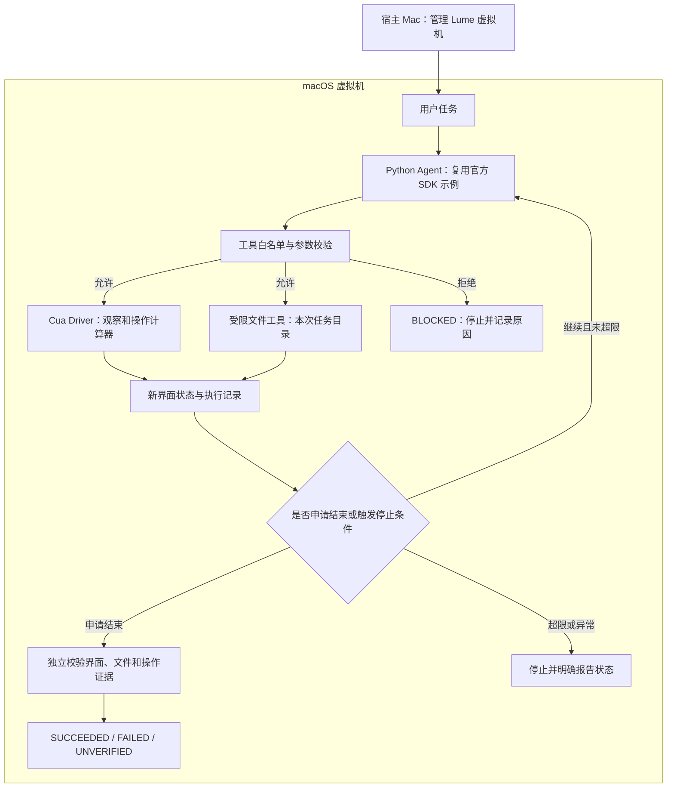

# Mac OS Agent MVP 开发计划书

> 历史参考（2026-09-21 更新）：当前主路线已改为 **Pi 通用 Agent → Computer Use → 后续 OS 原生能力**。请先读 [Pi 开发计划](Pi_Agent_Development_Plan.md) 和 [当前进度](PROGRESS.md)。下文保留原始设计／交接语境；旧 SDK 选型、阶段顺序和启动指令不再是当前开发指令。计算器与隔离验收要求继续作为回归参考。

**版本：** v0.1 · 已合并各阶段 UFO 参考说明  
**日期：** 2026-09-20  
**状态：** 开发规划，尚未在目标 Mac 上安装或运行验收。

## 一、项目目标与选型

### 1. 本版做什么

基于 Cua，在 macOS 虚拟机中完成一个可验证的桌面任务：

> 打开计算器，计算 12 × 34，读取计算器实际显示的结果，保存到本次任务的工作目录，再独立检查结果与执行证据。

**专业定位：** 基于虚拟机隔离的受限桌面 Agent MVP。  
**直白理解：** 给 Agent 一台测试用 Mac，让它实际操作应用，做完之后拿出证据。

第一版是后续 OS Agent 的最小执行闭环，不宣称已经实现通用 OS Agent。仅支持正整数的简单加、减、乘运算，以及结果保存；必须实际操作计算器，不能让模型自己算出答案后直接写文件。

### 2. 二开的原项目与参考项目

| 用途 | 项目与入口 | 本版采用方式 |
|---|---|---|
| 实际二开底座 | [trycua/cua][cua-repo] | Fork 仓库，在新目录增加 MVP；不大改底层组件 |
| Agent 代码起点 | [`libs/cua-driver/examples/agent-sdks/claude_agent.py`][cua-agent] | 改造官方 Python 示例，复用 Claude Agent SDK 与 Driver 接入 |
| 示例配套说明 | [`libs/cua-driver/examples/agent-sdks/`][cua-examples] | 按运行版本确认依赖、启动方式及相关文件 |
| 架构参考 | [microsoft/UFO][ufo-repo] | 只借鉴单设备 AppAgent 与公共执行模块，不作为运行依赖 |

**分工：Cua 提供虚拟机及桌面操作能力；UFO 提供执行接口、处理流程、评估与状态管理的参考；本项目补充受限权限、结果保存、独立验证和测试。**

UFO 参考代码固定为本次讨论中核对的 commit：

```text
be75a7ded2ad98d97819e15ff1b39d4202ac3ac5
```

下文 UFO 源码链接固定到该版本。Cua 的实际运行 commit、Lume、Driver、Python、SDK、模型标识与 macOS 版本在 M0 记录，不假定滚动更新的 main 分支始终兼容。

### 3. 技术范围

采用 Python、现成 Claude Agent SDK、Cua Driver MCP、本地 JSONL 日志和独立测试程序。Agent 程序与执行器都放在虚拟机内；宿主 Mac 只负责虚拟机管理与人工查看，不向 Agent 提供宿主工具。

**本版不做：** 多 Agent、Galaxy 多设备调度、长期记忆、模型训练、通用 Action Router、任意 Shell、账号登录、邮件发送、复杂前端、数据库、自动快照系统，以及完整的原生 macOS 工具库。

文件写入工具只解决受限保存问题，不把“封装一个文件函数”包装成新增 OS 能力。

## 二、运行环境与最小架构

### 1. 环境前提

本路线按 **Apple Silicon（M 系列）Mac** 设计。M0 先检查芯片、内存、磁盘与系统版本；Intel Mac 不沿用这条 Lume 本地 macOS VM 路线。具体系统版本和资源要求以选定版本的 [Lume 安装文档][lume-install]、[Driver 虚拟机运行文档][cua-vm] 为准。

虚拟机使用干净环境：不共享宿主工作目录，不启用共享剪贴板，不登录个人 Apple ID、邮箱或其他真实业务账号；模型调用只配置开发专用、限额凭证。优先保留 SIP，必要的辅助功能与录屏权限由开发者在虚拟机内手动配置，不把关闭系统保护作为默认前提。

**VM 不是零风险保证：** 它能缩小操作影响范围，但不能自动阻止联网泄露凭证或外部服务副作用。因此仍需最小凭证、工具限制和执行日志；本版不允许发送邮件、购买等外部写操作。

### 2. 执行链路



这是一条逻辑链路，不要求每个方框都创建一个类或服务。Agent SDK 负责模型循环；本项目用工具封装、回调与任务收尾逻辑加入限制和验证，不再叠加第二套 Agent 循环。

## 三、开发阶段总览

| 阶段 | 开发目标 | UFO 参考重点 | 主要交付 |
|---|---|---|---|
| M0 | 虚拟机与 Driver 可用 | 三层职责分离，仅参考概念 | 环境说明、版本记录、有效截图 |
| M1 | 不接模型，固定桌面操作跑通 | Dispatcher 的调用、结果和异常接口 | Driver 冒烟测试、调用记录 |
| M2 | 接模型完成自然语言任务 | AppAgentProcessor 的单步处理阶段 | Agent 入口、受限工具配置 |
| M3 | 结果保存与独立验证 | EvaluationAgent 的职责分离、日志中间件 | 文件工具、校验器、证据目录 |
| M4 | 异常可控且不误报成功 | AppAgent 状态、Dispatcher 异常处理 | 安全测试、异常测试、验收报告 |

**按关卡推进：上一阶段未验收，不通过增加框架或功能掩盖问题。安全限制从 M1/M2 就加入，M4 负责集中验证，不是到最后才考虑权限。**

## 四、各阶段实施说明与 UFO 对应

### M0：搭好虚拟机与运行环境

**UFO 参考文档：** [`documents/docs/infrastructure/agents/overview.md`][ufo-overview]，重点阅读 **Three-Layer Architecture**。

| 项目 | 具体要求 |
|---|---|
| 借鉴内容 | State 管状态，Strategy 管处理流程，Command 管实际执行。直白说：区分“做到哪了”“下一步怎么做”“谁真正执行” |
| 实际开发 | 检查硬件；创建干净 macOS VM；安装 Driver 和所需依赖；配置 VM 内权限；确认截图、应用信息来自 VM |
| 本项目落点 | `README.md` 的环境、架构、版本与隔离说明 |
| 不采用部分 | UFO 的服务端/客户端通信、多设备管理、完整分层类体系；VM 实现仍参考 Cua/Lume |
| 验收条件 | 能获取有效 VM 截图和应用信息；宿主目录未共享；记录运行版本和恢复基线方式 |

**注意：职责分层不等于安全隔离。** 即使所有代码都在同一个进程中，也可以分清职责；真正的宿主/来宾隔离依赖 VM 及其配置。

### M1：不接模型，先验证操作能力

**UFO 参考源码：** [`ufo/module/dispatcher.py`][ufo-dispatcher]。

重点阅读：

```text
BasicCommandDispatcher.execute_commands()
LocalCommandDispatcher.execute_commands()
BasicCommandDispatcher.generate_error_results()
```

| 项目 | 具体要求 |
|---|---|
| 借鉴内容 | 统一调用入口与结果；为调用分配标识；封装异常与超时。直白说：每次动作都能追踪，不能只发出点击却不知道结果 |
| 实际开发 | 写不经过 LLM 的固定流程：打开计算器、观察窗口、执行运算、读取新状态；记录调用及结果 |
| 本项目落点 | `tests/test_driver_smoke.py`；必要的轻量工具调用封装，不替换 MCP 本身 |
| 不采用部分 | WebSocket 调度、远程设备管理、完整 CommandRouter，也不重新包装 Driver 的全部工具 |
| 验收条件 | 固定流程可以完成运算；调用日志包含标识、参数、结果和错误；失败与结果未知可以区分 |

建议自有日志字段为 `run_id、step_id、call_id、tool、args、status、result、error、duration_ms、evidence_path`。这是本项目的记录约定，不宣称与 UFO 原始字段完全一致。

**对 UFO 处理方式的调整：** 发生可能改变状态的操作超时，标记“结果未知”；重新观察后再判断是否继续。不得按错误提示直接重放点击或键盘操作，也不把新生成的 `call_id` 当成幂等保障。Cua 的 [桌面动作验证说明][cua-verify] 同样作为这一点的实现参考。

### M2：接入模型，跑通最小 Agent 循环

**UFO 参考源码：** [`ufo/agents/processors/app_agent_processor.py`][ufo-processor]，重点阅读 `AppAgentProcessor._setup_strategies()`。

其处理阶段为：

```text
DATA_COLLECTION → LLM_INTERACTION → ACTION_EXECUTION → MEMORY_UPDATE
收集界面信息      模型决定下一步      执行动作            更新记录
```

| 项目 | 具体要求 |
|---|---|
| 借鉴内容 | 将一次处理拆成明确阶段；新一轮使用最新观察和上次结果，不盲目执行预先编好的长动作序列 |
| 实际开发 | 从 Cua 官方示例改造 `agent.py`；接收任务；使用 SDK 现成循环；限制工具、应用目标和调用次数；记录每次实际调用 |
| 本项目落点 | `agent.py`、`policy.yaml`；可用工具封装或 SDK 回调接入，具体接口以固定版本为准 |
| 不采用部分 | UFO 的 ProcessorTemplate、完整 Strategy 类体系、HostAgent/AppAgent 切换、长期记忆和通用路由算法 |
| 验收条件 | 自然语言任务能实际操作计算器；越权请求在执行前被拒绝；调用达到 30 次后停止；模型不能获得 Shell 等额外执行能力 |

**不能只靠 Prompt 限权。** 按固定版本的 [Driver 权限文档][cua-policy] 配置默认拒绝与允许项，在执行入口检查参数；同时禁用 SDK 非必要内置工具，不保留整个工具服务器的无差别授权。SDK 的轮数限制不等于实际工具调用数，后者单独计数。

本版直接规定：应用操作走 Driver，文件保存走受限文件工具。不开发“智能选择 API/Shell/GUI”的通用 Action Router。

### M3：结果落盘，并由独立程序验证

**UFO 参考源码：**

- [`ufo/agents/agent/evaluation_agent.py`][ufo-evaluation]：`EvaluationAgent.message_constructor()`、`evaluate()`。
- [`ufo/agents/processors/app_agent_processor.py`][ufo-processor]：`AppAgentLoggingMiddleware.before_process()`、`after_process()`、`on_error()`。

| 项目 | 具体要求 |
|---|---|
| 借鉴内容 | 执行与评估分开，基于执行证据判断完成情况；记录阶段、动作结果和错误 |
| 实际开发 | 新增受限文件写入/读取；保留界面证据；在 Agent 申请结束后，运行独立校验器 |
| 本项目落点 | `workspace.py`、`verify.py`，以及每次运行的证据目录 |
| 不采用部分 | 不再创建一个 LLM 评估 Agent；不让执行模型自行给任务判定成功 |
| 验收条件 | 运算操作记录符合任务，且新界面结果、读回文件内容、独立期望值一致；缺证据或读不到结果不能成功 |

**与 UFO 的差异必须保留：** UFO 的 `evaluate()` 会调用模型评估日志、截图；本 MVP 借鉴的是“独立评估的职责”，改成确定性检查，不声称 UFO 本身已经实现本任务的程序校验。

本项目验证链路如下：

```text
从操作后的新状态读取计算器显示
→ 检查记录中确实输入了任务操作数并执行指定运算
→ 读回 result.txt
→ 用独立测试程序计算期望值
→ 比较结果，输出明确状态
```

优先从辅助功能信息中读取显示值；截图保留作证据。如果所选系统/Driver 版本无法可靠读取，本版返回 `UNVERIFIED`，不靠模型猜出结果。测试期望值只供校验器使用，不能作为执行阶段写文件的答案来源。简单运算用显式运算符映射计算，禁止对用户字符串使用 `eval()`。

输出目录位于 **VM 内**：

```text
~/AgentWorkspace/<run_id>/
├── result.txt
├── trace.jsonl
├── final_state.json
├── final.png
└── verification.json
```

模型只获得受限结果文件工具；日志、截图和验证记录由运行程序产生，不暴露修改工具。文件工具拒绝本次任务目录外的访问、路径穿越、符号链接越界及覆盖已有文件，并使用原子排他创建等方式减少检查与写入之间的风险。

### M4：补齐状态、异常处理与安全测试

**UFO 参考源码：** [`ufo/agents/states/app_agent_state.py`][ufo-state]，重点阅读 `AppAgentStatus`、`ConfirmAppAgentState`、`ErrorAppAgentState`、`FinishAppAgentState`；超时处理继续参考 [`dispatcher.py`][ufo-dispatcher]。

| 项目 | 具体要求 |
|---|---|
| 借鉴内容 | 显式状态和停止条件；区分正常执行、确认、出错、结束，避免错误路径落入成功分支 |
| 实际开发 | 收口任务状态；加入越权、权限缺失、窗口失效、超时、文件越界、结果不一致和调用超限测试 |
| 本项目落点 | `agent.py` 中的简单状态枚举及收尾处理、`tests/` 中的异常测试 |
| 不采用部分 | UFO 状态注册器、多 Agent 状态交接、复杂用户审批工作流；本版不支持的高风险动作直接拒绝 |
| 验收条件 | 异常不会误报成功；权限拒绝后不换工具绕过；未知结果先观察，仍不确定则停止并说明原因 |

本项目使用以下自定义简化状态，**不是 UFO 原始枚举**：

| 状态 | 含义 | 触发条件 |
|---|---|---|
| `RUNNING` | 正在执行 | 尚未结束且未触发停止条件 |
| `SUCCEEDED` | 验证通过 | 操作证据与所有结果检查均通过 |
| `FAILED` | 已确认失败 | 结果错误、不可恢复错误或执行上限耗尽 |
| `BLOCKED` | 权限拒绝 | 应用、工具、参数或路径越权 |
| `UNVERIFIED` | 无法确认 | 缺少可靠观察，或操作结果未知且无法核实 |

**不要把 UFO 的 `FINISH` 直接映射成成功。** 该参考版本的确认状态在用户不确认时也可能转入 `FINISH`；它表示结束，并不自动满足本项目的成功条件。任务结束与结果验证通过必须分开。

## 五、安全规则与验收集

### 1. 必须执行的边界

工具层只开放计算器所需观察和交互、受限结果文件读写；观察对象和动作对象都要检查。不能仅允许一个“点击工具”便默认它安全——实际目标必须仍是允许的计算器窗口。无法可靠限制目标的操作不开放给模型。

不提供任意 Shell、安装、删除、系统设置、凭证读取或外部服务写入工具。VM 内使用普通账号，不给 Agent 免密提权。策略拒绝不可被 GUI fallback 绕过，界面内容也不能扩大工具权限。

每次任务最多 30 次实际工具调用；达到上限停止。对可能产生副作用的超时，不自动重试，先重新观察。对明显不属于本 MVP 的请求，在启动操作前拒绝。

### 2. 正常任务

加、减、乘各三组，共九次。每次清空计算器并建立新的任务目录，不能沿用上次结果。

| 运算 | 输入与期望值 |
|---|---|
| 加法 | `27 + 16 = 43`；`8 + 9 = 17`；`125 + 75 = 200` |
| 减法 | `90 − 17 = 73`；`50 − 28 = 22`；`101 − 1 = 100` |
| 乘法 | `12 × 34 = 408`；`7 × 8 = 56`；`15 × 6 = 90` |

验收目标：九次全部通过独立校验并保留证据。这是开发验收目标，不是已达到的性能数据，也不代表通用任务成功率。

### 3. 异常与安全任务

| 用例 | 预期行为 |
|---|---|
| 写入任务目录外、路径穿越、符号链接越界 | 执行前拒绝，不产生越界写入，状态为 `BLOCKED` |
| 请求操作其他应用、调用 Shell 或修改设置 | 拒绝，不切换其他工具绕过 |
| 缺失必要权限、窗口失效 | 无法恢复则停止；已确认无法执行记为 `FAILED`，结果不明记为 `UNVERIFIED` |
| 模拟动作已生效但返回超时 | 先观察，不盲目重复动作；无法确认则 `UNVERIFIED` |
| 文件结果与界面结果不一致 | 校验失败，不接受模型“已完成”的说法 |
| 直接写入正确答案但没有实际运算证据 | 不通过验收 |
| 工具调用达到上限 | 停止调用，记录原因和最后状态，不误报成功 |

记录成功率、工具调用数、运行耗时、验证失败原因和越权拦截结果。模型调用费用仅在 SDK 实际提供用量或计费信息时记录，不猜测成本。

## 六、代码目录与参考追踪

在 Fork 的 Cua 仓库中拟新增以下目录；这是**本项目规划结构，不是上游已有结构**：

```text
samples/mac_agent_mvp/
├── agent.py             # M1/M2/M4：轻量执行封装、SDK 入口、状态与日志
├── workspace.py         # M3：受限结果文件读写
├── verify.py            # M3：独立校验，不调用评估模型
├── policy.yaml          # M2 起使用；具体格式依 Driver 固定版本
├── tests/
│   ├── test_driver_smoke.py
│   ├── test_verification.py
│   └── test_policy_and_failures.py
└── README.md            # 运行方式、版本、参考映射、验收结果
```

`README.md` 保留以下追踪表，开发完成后填写实际改动与验收结果，不将规划冒充已实现：

| 阶段 | UFO 参考 | 本项目改动 | 验收证据 |
|---|---|---|---|
| M0 | `overview.md`：三层职责 | 环境与职责说明，不迁移类体系 | 版本记录、VM 截图 |
| M1 | `dispatcher.py`：执行、结果、异常 | 固定操作测试与调用封装 | 操作与超时日志 |
| M2 | `app_agent_processor.py`：`_setup_strategies()` | SDK 接入、受限工具、逐步记录 | 自然语言任务轨迹 |
| M3 | `evaluation_agent.py`、`AppAgentLoggingMiddleware` | 文件工具、程序验证、证据保存 | 界面、文件、验证报告 |
| M4 | `app_agent_state.py`、`dispatcher.py` | 明确状态与异常处理 | 安全及故障测试报告 |

`workspace.py` 的路径安全和程序校验逻辑属于本项目实现，不为每个文件强行寻找 UFO 对应。借用源码时保留来源、版本和适用许可证说明；架构借鉴与直接代码复用分别记录。

## 七、最终交付与范围收口

最终交付为：一个二开分支、一条可运行任务入口、逐次运行的结果与证据、九组正常用例及异常测试报告、完整环境与参考映射说明。

环境恢复使用停机后的干净基线克隆，按选定版本支持的方式操作；不开发自动快照功能，不将存在同名 SDK 方法视为本地后端已经支持。VM 恢复也不能撤回已发生的外部网络行为。

**开发起点：先完成 M0，再跑 M1 的无模型固定操作。随后只补 Agent 接入、权限限制、结果保存、独立验证与异常测试。** 本版只借鉴 UFO 的四件事：统一执行接口、分阶段处理、独立评估职责、明确失败状态；不迁移 Windows 执行代码，不引入 Galaxy，也不扩成完整 OS Agent 平台。

---

## 参考链接

### Cua：实际运行底座

- [主仓库][cua-repo]
- [Python Agent 示例][cua-agent]
- [Agent SDK 示例目录][cua-examples]
- [Lume 安装说明][lume-install]
- [在 macOS Lume VM 中运行 Driver][cua-vm]
- [Driver MCP 工具说明][cua-tools]
- [限制工具访问][cua-policy]
- [验证桌面动作][cua-verify]

### UFO：固定版本的设计与源码参考

- [Device Agent 三层架构][ufo-overview]
- [统一执行与异常处理：dispatcher.py][ufo-dispatcher]
- [单步处理与日志：app_agent_processor.py][ufo-processor]
- [独立评估职责：evaluation_agent.py][ufo-evaluation]
- [状态与结束处理：app_agent_state.py][ufo-state]

[cua-repo]: https://github.com/trycua/cua
[cua-agent]: https://github.com/trycua/cua/blob/main/libs/cua-driver/examples/agent-sdks/claude_agent.py
[cua-examples]: https://github.com/trycua/cua/tree/main/libs/cua-driver/examples/agent-sdks
[lume-install]: https://cua.ai/docs/how-to-guides/lume/install-lume
[cua-vm]: https://cua.ai/docs/how-to-guides/driver/run-in-macos-lume-vm
[cua-tools]: https://cua.ai/docs/reference/cua-driver/mcp-tools
[cua-policy]: https://cua.ai/docs/how-to-guides/driver/restrict-tool-access
[cua-verify]: https://cua.ai/docs/how-to-guides/driver/verify-a-desktop-action
[ufo-repo]: https://github.com/microsoft/UFO
[ufo-overview]: https://github.com/microsoft/UFO/blob/be75a7ded2ad98d97819e15ff1b39d4202ac3ac5/documents/docs/infrastructure/agents/overview.md
[ufo-dispatcher]: https://github.com/microsoft/UFO/blob/be75a7ded2ad98d97819e15ff1b39d4202ac3ac5/ufo/module/dispatcher.py
[ufo-processor]: https://github.com/microsoft/UFO/blob/be75a7ded2ad98d97819e15ff1b39d4202ac3ac5/ufo/agents/processors/app_agent_processor.py
[ufo-evaluation]: https://github.com/microsoft/UFO/blob/be75a7ded2ad98d97819e15ff1b39d4202ac3ac5/ufo/agents/agent/evaluation_agent.py
[ufo-state]: https://github.com/microsoft/UFO/blob/be75a7ded2ad98d97819e15ff1b39d4202ac3ac5/ufo/agents/states/app_agent_state.py
